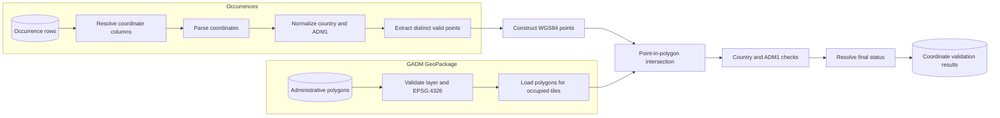
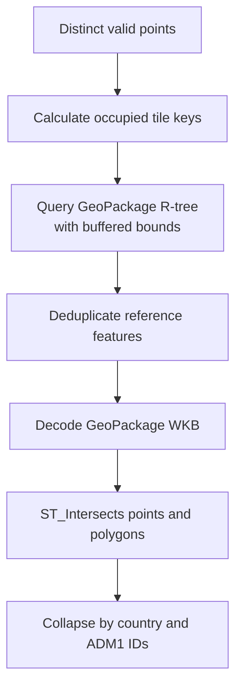
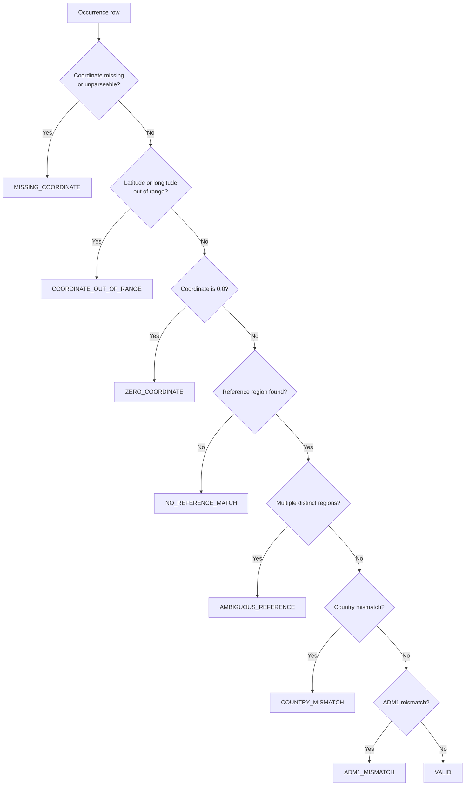
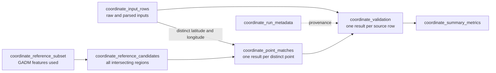

# Coordinate validation algorithm

This document specifies how `colharmonize` validates occurrence coordinates against GADM
administrative geometries. The process checks coordinate syntax and range, locates coordinates in
reference polygons, and compares the interpreted geography with recorded country and ADM1 data.

Validation results are **not probabilities**. A mismatch identifies an inconsistency; it does not
by itself prove which value is incorrect. Original occurrence values are never modified.

### Mathematical notation

| Symbol | Meaning |
| --- | --- |
| $x$ | Parsed longitude |
| $y$ | Parsed latitude |
| $P$ | WGS84 point constructed as longitude, then latitude |
| $N_a(s)$ | Normalized ADM1 name derived from string $s$ |
| $G_0(P)$ | Reference country containing point $P$ |
| $M_c$ | Whether recorded and reference countries match |
| $M_a$ | Whether recorded and reference ADM1 values match |

## End-to-end workflow

## 1. Input normalization

Let an occurrence provide latitude $y$, longitude $x$, optional country $c$, and optional
first-level administrative division $a$, such as state or province.

Coordinates are parsed numerically:

$$
y=\operatorname{numeric}(\text{latitude}),
\qquad
x=\operatorname{numeric}(\text{longitude}).
$$

Unparseable, missing, NaN, or infinite values are treated as missing coordinates. Parsing and
normalization affect comparison fields only; raw source values remain in the output.

Country values may be names, ISO alpha-2 codes, or ISO alpha-3 codes. Recognized values are
resolved to an uppercase alpha-3 code. Unrecognized territories retain a normalized-name fallback.

ADM1 names use

$$
N_a(s)=\operatorname{alphanumeric}\left(
  \operatorname{removeAdminWords}\left(
    \operatorname{lower}(\operatorname{stripAccents}(\operatorname{trim}(s)))
  \right)
\right),
$$

where common administrative words include `state`, `province`, `region`, and `department`.
Punctuation and whitespace are removed after those words are discarded.

## 2. Basic coordinate checks

Coordinates must satisfy

$$
-90\le y\le90,
\qquad
-180\le x\le180.
$$

Checks are evaluated in order:

| Coordinate check | Condition |
| --- | --- |
| `MISSING_COORDINATE` | Latitude or longitude is absent, unparseable, or non-finite |
| `LATITUDE_OUT_OF_RANGE` | $y<-90$ or $y>90$ |
| `LONGITUDE_OUT_OF_RANGE` | $x<-180$ or $x>180$ |
| `ZERO_COORDINATE` | $y=0\land x=0$ |
| `VALID_COORDINATE` | Both values are finite and geographically valid |

Only valid coordinates proceed to administrative lookup. Each distinct valid pair is processed
once, then joined back to every source row using that pair.

The point is constructed in longitude-latitude order:

$$
P=\operatorname{Point}(x,y).
$$

## 3. Tiled administrative lookup

The reference GeoPackage must use WGS84/EPSG:4326 and provide at least:

- `GID_0` and `COUNTRY` for country identity.
- `GID_1` and `NAME_1` for ADM1 identity.
- A geometry column with a GeoPackage R-tree.

To avoid loading irrelevant global geometry, valid points are assigned to tiles of width $t$
degrees, with default $t=5$:

$$
T_x=\left\lfloor\frac{x}{t}\right\rfloor t,
\qquad
T_y=\left\lfloor\frac{y}{t}\right\rfloor t.
$$

The GeoPackage R-tree selects polygons whose bounding boxes intersect each occupied tile plus a
small buffer $b$, defaulting to $0.001^\circ$.

Point membership is

$$
\operatorname{inside}(P,G)=\operatorname{ST\_Intersects}(P,G).
$$

Duplicate source features belonging to the same `(GID_0, GID_1)` region collapse into one
administrative match. If a point intersects more than one distinct country/ADM1 pair, its
reference result is `AMBIGUOUS_REFERENCE`; the validator does not select a polygon using the
recorded locality, because that would make the validation circular.

## 4. Country check

Let $I(c)$ be the ISO alpha-3 code resolved from the recorded value and let $G_0(P)$ be the
reference `GID_0` for the uniquely matched region. When ISO resolution is unavailable, normalized
country names are compared instead.

$$
M_c = I(c)=G_0(P).
$$

| Country check | Meaning |
| --- | --- |
| `COUNTRY_MATCH` | Recorded and reference countries agree |
| `COUNTRY_MISMATCH` | Recorded and reference countries differ |
| `COUNTRY_NOT_PROVIDED` | No recorded country was supplied |
| `NO_REFERENCE_MATCH` | The point did not intersect reference geography |
| `AMBIGUOUS_REFERENCE` | The point intersected multiple distinct administrative regions |

Country validation does not depend on whether ADM1 data was supplied.

## 5. ADM1 check

For recorded ADM1 $a$ and uniquely resolved reference name $A(P)$, the comparison is

$$
M_a=N_a(a)=N_a(A(P)).
$$

ADM1 comparison occurs within the coordinate's reference country, preventing identically named
regions in different countries from producing false matches.

| ADM1 check | Meaning |
| --- | --- |
| `ADM1_MATCH` | Recorded and reference ADM1 names agree |
| `ADM1_MISMATCH` | Recorded and reference ADM1 names differ |
| `ADM1_NOT_PROVIDED` | No recorded ADM1 was supplied |
| `NO_ADM1_REFERENCE_MATCH` | Reference geography provided no ADM1 name |
| `AMBIGUOUS_REFERENCE` | More than one distinct reference region intersected the point |

Country and ADM1 checks remain separate so one result never hides the other.

## 6. Final validation status

The final status is the first applicable result in this precedence order:

Formally,

$$
S=
\begin{cases}
\texttt{MISSING_COORDINATE}, & x\text{ or }y\text{ is missing or invalid},\\
\texttt{COORDINATE_OUT_OF_RANGE}, & x\notin[-180,180]\text{ or }y\notin[-90,90],\\
\texttt{ZERO_COORDINATE}, & x=0\land y=0,\\
\texttt{NO_REFERENCE_MATCH}, & C(P)\text{ cannot be determined},\\
\texttt{AMBIGUOUS_REFERENCE}, & P\text{ intersects multiple distinct regions},\\
\texttt{COUNTRY_MISMATCH}, & M_c=\text{false},\\
\texttt{ADM1_MISMATCH}, & M_a=\text{false},\\
\texttt{VALID}, & \text{otherwise}.
\end{cases}
$$

A valid, uniquely located coordinate remains `VALID` when country or ADM1 metadata was not
provided. The component checks explicitly record those omissions.

## 7. Results and auditability

Each result retains raw coordinates, parsed coordinates, optional source identifier, recorded
country and ADM1, interpreted reference geography, every component check, and final status.
Reference candidates and the source GADM fingerprint remain available for auditing border and
no-match cases.

The validator reports inconsistencies only. Coordinate correction or later georeferencing must
be stored separately from the supplied occurrence values.
