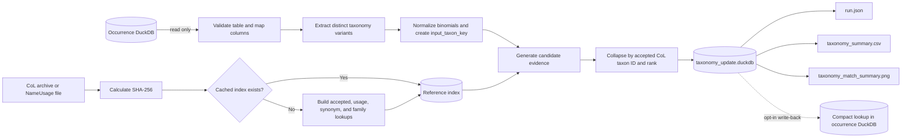
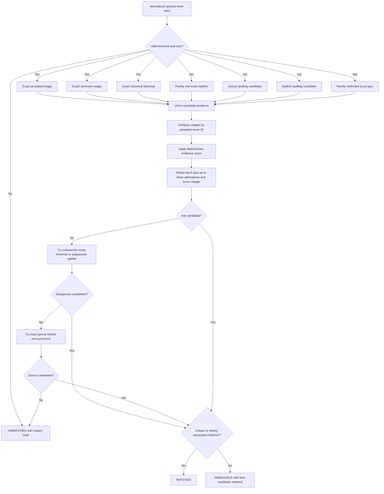

# colharmonize

`colharmonize` creates compact, auditable species-name matches against Catalogue of Life releases
and validates occurrence coordinates against GADM administrative geography.

Algorithm references:

- [Taxonomy matching](TAXONOMY_MATCHING.md) explains normalization, candidate methods,
  mathematical scoring, ranking, and ambiguity decisions.
- [Coordinate validation](COORDINATE_VALIDATION.md) specifies coordinate checks,
  administrative spatial matching, and locality validation.

```bash
uv sync
uv run colharmonize init
uv run colharmonize inspect --db occurrences.duckdb --list-tables
uv run colharmonize inspect --db occurrences.duckdb --list-columns main.occurrence
uv run colharmonize inspect --db occurrences.duckdb --table main.occurrence \
  --map scientific_name=species
uv run colharmonize run --db occurrences.duckdb --table main.occurrence \
  --map scientific_name=species --col NameUsage.tsv --output results --csv --plot \
  --plot-palette Dark2
uv run colharmonize validate-coordinates --db occurrences.duckdb \
  --table main.occurrence --gadm gadm.gpkg --output coordinate-results
```

During `run`, the CLI reports each processing phase with live elapsed time and an estimated
remaining time. The final line reports total runtime and distinct-taxa throughput. With `--plot`,
`taxonomy_match_summary.png` contains an update-status pie chart and a match-method breakdown,
using the ColorBrewer `Dark2` palette by default. Pass any named Seaborn palette through
`--plot-palette`, or set `plot_palette` in the `[run]` configuration table.

Use `--config colharmonize.toml` with `inspect`, `index`, `run`, or `validate-coordinates`. CLI
values override TOML. Run `colharmonize init --output -` to inspect the complete configuration
template.

`validate-coordinates` detects standard Darwin Core fields (`occurrenceID`, `decimalLatitude`,
`decimalLongitude`, `countryCode` or `country`, and `stateProvince`). Override a field with
`--map FIELD=COLUMN`; the supported logical fields are `source_id`, `latitude`, `longitude`,
`country`, and `adm1`. The GADM input must be an EPSG:4326 GeoPackage with an indexed ADM1 layer
containing `GID_0`, `COUNTRY`, `GID_1`, and `NAME_1`. Use `--gadm-layer` when it cannot be selected
automatically.

Coordinate validation writes `coordinate_validation.duckdb` and `coordinate_run.json` without
modifying either source. The database retains parsed input rows, distinct valid points, the GADM
subset and all intersecting candidates, resolved point matches, final validation results, summary
counts, and run provenance. See [Coordinate validation](COORDINATE_VALIDATION.md) for the status
precedence and mathematical definition.

## Matching workflow



Within each rank, candidate methods run as a union. Ranks form a cascade: species → subspecies → genus. A later rank is tried only when the earlier stage has no candidates; ambiguous results stop the cascade. Explicit subspecies and genus inputs begin at their own rank.



The primary artifact is `taxonomy_update.duckdb`. It contains `input_taxa`, `input_taxon_variants`, `taxonomy_matches`, `taxonomy_candidates`, `summary_metrics`, and `run_metadata`. Scores are deterministic evidence scores, not probabilities.

To copy a compact lookup into the source database, add `--write-back-table main.taxonomy_lookup`. This opt-in operation creates a new table and fails if that table already exists.

Join an external result by the original source fields:

```sql
ATTACH 'results/taxonomy_update.duckdb' AS harmonized;
SELECT occurrence.*, matches.accepted_name, matches.update_status
FROM occurrence
LEFT JOIN harmonized.input_taxon_variants variants
  ON occurrence.species = variants.original_scientific_name
 AND occurrence.family IS NOT DISTINCT FROM variants.original_family
LEFT JOIN harmonized.taxonomy_matches matches USING (input_taxon_key);
```

Species, subspecies, and genus inputs are supported. Subspecies fallback compares the species epithet against subspecies epithets when no complete trinomial is supplied. Complete trinomials retain their parent species constraint for non-exact comparisons. Genus fallback requires an exact accepted name or synonym and filters by supplied family; multiple accepted genus candidates remain ambiguous. Genus taxa must exist in the reference.

`accepted_species_name` contains the accepted binomial without authorship. Species matches use their own binomial; subspecies require a matching accepted species in the reference (same genus, specific epithet, and family when supplied by the accepted subspecies). Genus matches, unmatched rows, and subspecies without an accepted species reference have NULL (empty in CSV). For ambiguous rows, this column describes the selected candidate, just as `accepted_name` does. The column is included in CSV and optional write-back; exports from older databases leave it empty.

`accepted_rank` records the actual matched rank. Subspecies and genus methods use `SUBSPECIES_` and `GENUS_` prefixes. `alternative_matches` replaces the runner-up columns with up to three other accepted names, separated by `; ` and ordered by candidate rank. It excludes the selected taxon, collapses duplicate evidence by accepted ID, and is independent of `top_k`; no alternatives is NULL (empty in CSV). `score_margin` still uses the second candidate internally. Summary export also supports older databases, converting their runner-up name to a single alternative.

Map an optional subspecies column with `infraspecific_epithet=infraspecificEpithet` or configure it under `[columns]`. Structured epithets take precedence; parsing supports lowercase trinomials and `subsp.`/`ssp.` markers. Supplied authorship is stripped before parsing; capitalized author surnames are not interpreted as epithets. Supply the structured field when name casing or authorship is ambiguous. Missing rank still defaults to species; genus-only input needs rank `genus`.

Reference schema version 2 rebuilds old species-only caches automatically. Ambiguous and unmatched inputs remain explicit; no interactive review or overrides are performed.
