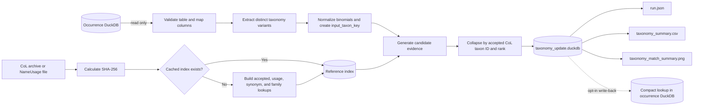
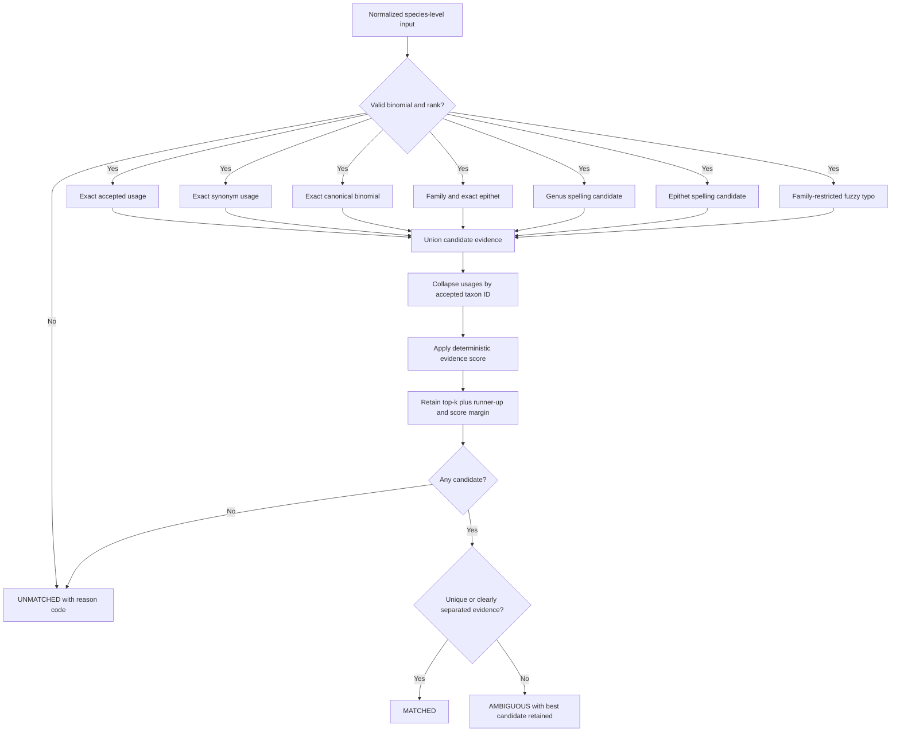

# colharmonize

`colharmonize` pre-generates compact, auditable species-name matches against a Catalogue of Life ColDP release.

```bash
uv sync
uv run colharmonize init
uv run colharmonize inspect --db occurrences.duckdb --list-tables
uv run colharmonize inspect --db occurrences.duckdb --list-columns main.occurrence
uv run colharmonize inspect --db occurrences.duckdb --table main.occurrence \
  --map scientific_name=species
uv run colharmonize run --db occurrences.duckdb --table main.occurrence \
  --map scientific_name=species --col NameUsage.tsv --output results --csv --plot
```

Use `--config colharmonize.toml` with `inspect`, `index`, or `run`. CLI values override TOML. Run `colharmonize init --output -` to inspect the complete configuration template.

## Matching workflow



Candidate methods run as a union rather than as a first-match-wins sequence:



The primary artifact is `taxonomy_update.duckdb`. It contains `input_taxa`, `input_taxon_variants`, `taxonomy_matches`, `taxonomy_candidates`, `summary_metrics`, and `run_metadata`. Scores are deterministic evidence scores, not probabilities.

To copy a compact lookup into the source database, add `--write-back-table main.taxonomy_lookup`. This opt-in operation creates a new table and fails if that table already exists.

Join an external result by the original source fields:

```sql
ATTACH 'results/taxonomy_update.duckdb' AS harmonized;
SELECT occurrence.*, matches.accepted_name, matches.update_status
FROM occurrence
LEFT JOIN harmonized.input_taxon_variants variants
  ON occurrence.species = variants.original_scientific_name
 AND occurrence.family IS NOT DISTINCT FROM variants.original_family
LEFT JOIN harmonized.taxonomy_matches matches USING (input_taxon_key);
```

Only species-level binomials are matched. Ambiguous and unmatched inputs remain explicit; no interactive review or overrides are performed.
