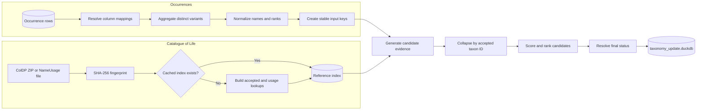
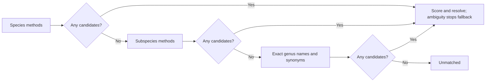
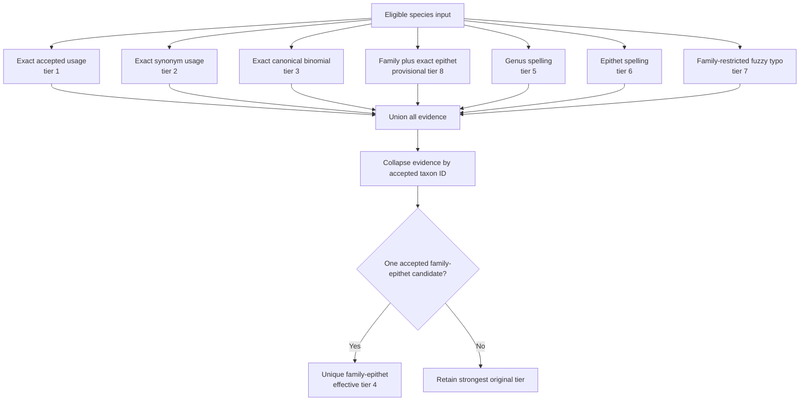
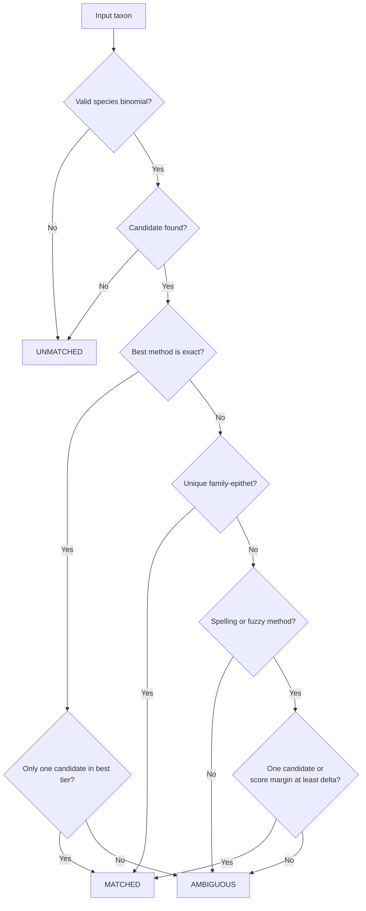
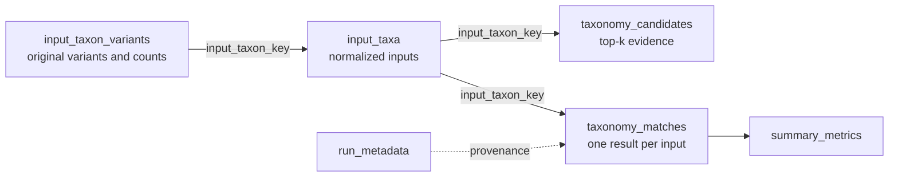

# Taxonomy matching algorithm

This document explains how `colharmonize` converts occurrence names into deterministic,
auditable matches against a Catalogue of Life (CoL) ColDP release.

The matcher operates on distinct taxonomic inputs rather than repeatedly matching duplicate
occurrence rows. Its scores rank evidence; they are **not probabilities**.

### Mathematical notation

| Symbol | Meaning |
| --- | --- |
| $N(n)$ | Normalized form of scientific name $n$ |
| $C(n)$ | Canonical binomial extracted from $n$ |
| $D(x,y)$ | Damerau-Levenshtein edit distance between strings $x$ and $y$ |
| $J(x,y)$ | Jaro-Winkler similarity between strings $x$ and $y$ |
| $L(x)$ | Number of characters in string $x$ |
| $B(m)$ | Base score assigned to matching method $m$ |
| $S_j$ | Total evidence score for candidate $j$ |

## End-to-end workflow

## 1. Reference index

The CoL source is fingerprinted with SHA-256. An index with the same source fingerprint and
schema version is reused; otherwise it is rebuilt atomically.

Species, subspecies, and genus name usages with identifiers and names enter reference schema
version 2. Genus records need a genus; species also need a specific epithet; subspecies additionally
need an infraspecific epithet. Canonical keys contain one, two, or three name parts by rank. Records whose status is `accepted` or `provisionally accepted` populate `accepted_taxa`.
Accepted names and synonyms populate `usage_lookup`, with every synonym linked to its accepted
taxon through `parentID` or `acceptedNameUsageID`.

The index provides lookups for normalized full names, canonical binomials, and family-epithet
pairs, subspecies epithets, and genus usages.

## 2. Input normalization

Let an occurrence provide scientific name $n$, optional structured genus $g_s$, specific
epithet $e_s$, family $f$, rank $r$, authorship $a$, order $o$, class $c$, and kingdom
$k$.

The normalized full name is

$$
N(n)=\operatorname{lower}\left(
  \operatorname{collapseWhitespace}\left(
    \operatorname{trim}\left(\operatorname{replace}(n,\_,\text{space})\right)
  \right)
\right).
$$

Parenthesized text is removed for parsing. Structured columns take precedence; otherwise the
first two parsed tokens become the genus and epithet:

$$
g=
\begin{cases}
\operatorname{lower}(g_s), & g_s\text{ is present},\\
\operatorname{token}_1(N(n)), & \text{otherwise},
\end{cases}
\qquad
e=
\begin{cases}
\operatorname{lower}(e_s), & e_s\text{ is present},\\
\operatorname{token}_2(N(n)), & \text{otherwise}.
\end{cases}
$$

The **canonical binomial** is

$$
C(n)=g\mathbin{\|}\text{space}\mathbin{\|}e.
$$

For example, `Panthera leo Linnaeus, 1758` has the canonical binomial `panthera leo`.

Missing rank defaults to `species`. Supported input ranks are `species`, `subspecies`, and `genus`.
Required name parts contain alphabetic characters, the hybrid sign, or hyphens. Genus inputs
require only a genus; explicit subspecies inputs require an infraspecific epithet as well.
Invalid inputs receive `UNSUPPORTED_RANK` or `INVALID_BINOMIAL` and generate no candidates.

The optional `infraspecific_epithet` mapping takes precedence over parsing. Parsing preserves
source case to recognize lowercase third epithets and `subsp.`/`ssp.` markers without mistaking
capitalized author surnames for epithets. Supplied trailing authorship is stripped first.
Structured epithets should be supplied for ambiguous or nonstandard name casing.

The stable input key is

$$
K=\operatorname{SHA256}\left(
  \operatorname{JSON}(N(n),g,e,e_{infra},f,r,a,o,c,k)
\right).
$$

Names with different family, authorship, rank, or higher classification therefore remain distinct
matching inputs. Original variants and occurrence counts are retained for joining results back to
the source.

## 3. Candidate generation

Within a rank, every eligible input is evaluated by all applicable methods and evidence forms a
union. Ranks form a cascade: species, then subspecies, then exact genus. A later stage receives
only inputs with **zero candidates** in earlier stages. Ambiguous results stop the cascade.
Explicit subspecies and genus inputs start at their own stage.

Subspecies matching uses the same method tiers, family blocking, spelling thresholds, and scoring.
Exact usage and canonical matching support full trinomials. When no infraspecific epithet is
supplied, the input species epithet is compared with reference subspecies epithets; an exact
genus/epithet pair is canonical evidence, and synonym pairs retain synonym evidence. Complete
trinomials require the parent species epithet to agree for non-exact comparisons. Exact synonyms
may resolve to a recombined accepted name. Accepted output retains the complete taxon name and ID.

Genus fallback compares exact accepted genus names and genus synonyms. A supplied family filters
candidates; without family all exact homonyms are retained. Only one distinct accepted genus is
matched, otherwise the result is ambiguous. There is no fuzzy genus-only search and no genus taxon
is fabricated from species records. Missing reference genera leave the input unmatched.

Let $D(x,y)$ be Damerau-Levenshtein distance, $J(x,y)$ be Jaro-Winkler similarity, and $L(x)$
be string length.

| Method | Candidate condition | Tier |
| --- | --- | ---: |
| `EXACT_ACCEPTED` | Normalized full name equals an accepted usage | 1 |
| `EXACT_SYNONYM` | Normalized full name equals a synonym linked to an accepted taxon | 2 |
| `EXACT_CANONICAL` | Genus and epithet exactly equal an accepted canonical binomial | 3 |
| `UNIQUE_FAMILY_EPITHET` | Exactly one accepted candidate has the same family and epithet | 4 |
| `SPELLING_GENUS` | Family and epithet are exact; genus passes the spelling rule | 5 |
| `SPELLING_EPITHET` | Family and genus are exact; epithet passes the distance rule | 6 |
| `FUZZY_TYPO` | Family is exact; both unequal name parts pass their spelling rules | 7 |

For input genus $g_i$ and candidate genus $g_j$, the genus rule is

$$
|L(g_i)-L(g_j)|\le2
\quad\land\quad
\left(D(g_i,g_j)\le d_g\;\lor\;J(g_i,g_j)\ge s_g\right),
$$

with defaults $d_g=2$ and $s_g=0.90$.

The default epithet distance limit is

$$
d_e(e_i)=
\begin{cases}
1, & L(e_i)\le5,\\
2, & L(e_i)>5.
\end{cases}
$$

An epithet candidate must satisfy

$$
|L(e_i)-L(e_j)|\le2
\quad\land\quad
D(e_i,e_j)\le d_e(e_i).
$$

Family equality is required for all family-assisted and fuzzy methods, preventing unrestricted
fuzzy comparisons across unrelated families.

## 4. Evidence collapse and scoring

Several usages or methods can identify the same accepted taxon. Evidence is first collapsed by
`(input_taxon_key, accepted_id)`. Candidate count therefore means distinct accepted taxa, not raw
name usages.

For candidate $j$, let $F_j$, $R_j$, and $A_j$ be binary indicators for exact family, rank,
and non-empty authorship matches. Its score is

$$
S_j=B(m_j)
  +300F_j+100R_j+200A_j
  +\operatorname{round}(100J(g_i,g_j))
  +\operatorname{round}(100J(e_i,e_j))
  -25\left(D(g_i,g_j)+D(e_i,e_j)\right).
$$

| Method $m_j$ | Base score $B(m_j)$ |
| --- | ---: |
| `EXACT_ACCEPTED` | 7000 |
| `EXACT_SYNONYM` | 6000 |
| `EXACT_CANONICAL` | 5000 |
| `UNIQUE_FAMILY_EPITHET` | 4000 |
| `SPELLING_GENUS` | 3000 |
| `SPELLING_EPITHET` | 2000 |
| `FUZZY_TYPO` | 1000 |
| Other provisional evidence | 500 |

Candidates are ordered by

$$
(\text{effective tier ascending},-S_j\text{ ascending},
  \text{accepted ID ascending}).
$$

Tier has precedence over score: a weaker method cannot outrank a stronger tier because of bonus
points. Accepted ID is the final deterministic tie-breaker. The output retains at most `top_k`
candidates per input. `alternative_matches` joins candidate ranks 2–4 with `; ` before that limit
is applied; it is NULL when there are none. Alternatives exclude the selected accepted ID and
come only from the stage that generated candidates. The second score is retained internally for
ambiguity decisions and `score_margin`, even when `top_k=1`. Public runner-up columns are removed.

## 5. Final resolution

Let $S_1$ and $S_2$ be the best and runner-up scores, $C$ the number of accepted candidates,
$T_1$ the number of candidates in the best tier, and $\delta$ the minimum score margin
(default $25$).

For species and subspecies, an eligible input is `MATCHED` when

$$
\begin{aligned}
&\left(m_1\in\{\text{EXACT_ACCEPTED},\text{EXACT_SYNONYM},
                     \text{EXACT_CANONICAL}\}\land T_1=1\right)\\
&\quad\lor\;m_1=\text{UNIQUE_FAMILY_EPITHET}\\
&\quad\lor\;\left(m_1\in\{\text{SPELLING_GENUS},\text{SPELLING_EPITHET},
                               \text{FUZZY_TYPO}\}
                 \land(C=1\lor S_1-S_2\ge\delta)\right).
\end{aligned}
$$

If candidates exist but this predicate is false, the result is `AMBIGUOUS`. Invalid inputs and
inputs without candidates are `UNMATCHED`.

## 6. Scaling and auditability

Let $R$ be occurrence-row count, $U$ distinct taxonomic inputs, and $A_{f_i}$ accepted taxa
in the family relevant to input $i$.

- Input aggregation is approximately $O(R)$.
- Candidate matching operates on $U$, not every occurrence row.
- Family-restricted fuzzy work is proportional to approximately
  $\sum_{i=1}^{U}A_{f_i}$, after equality and length filters.
- Damerau-Levenshtein comparison of lengths $p$ and $q$ is approximately $O(pq)$.
- The theoretical fuzzy worst case is $O(UA)$, but family blocking substantially reduces the
  practical search space.

The output preserves normalized inputs, candidate evidence, the winning score, score margin,
up to three alternative accepted names, reason codes, occurrence counts, the reference fingerprint,
matching configuration, and timing. Matches and candidates expose `accepted_rank`; public method
names prefix subspecies and genus methods with `SUBSPECIES_` and `GENUS_`, respectively.
Existing species method names remain unchanged. CSV and optional write-back include accepted rank
and alternatives. CSV regeneration from older outputs converts their runner-up name to a single
alternative and leaves accepted rank empty when unavailable.
