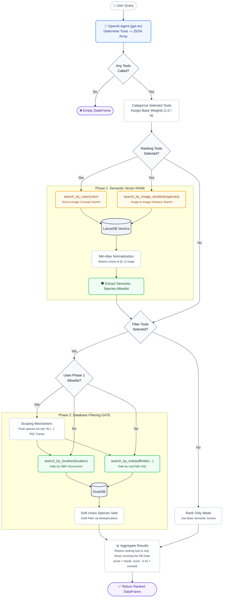

```mermaid
%%{init: {'theme': 'base', 'themeVariables': { 'primaryColor': '#ffffff', 'lineColor': '#64748b', 'fontFamily': 'ui-sans-serif, system-ui, -apple-system, BlinkMacSystemFont, "Segoe UI", Roboto, "Helvetica Neue", Arial, sans-serif'}}}%%
flowchart TD
    classDef default fill:#fff,stroke:#cbd5e1,stroke-width:2px,color:#334155,rx:8px,ry:8px;
    classDef agent fill:#eff6ff,stroke:#3b82f6,stroke-width:2px,color:#1e3a8a,rx:8px,ry:8px;
    classDef decision fill:#f8fafc,stroke:#94a3b8,stroke-width:2px,color:#0f172a,rx:16px,ry:16px;
    classDef filter fill:#f0fdf4,stroke:#22c55e,stroke-width:2px,color:#14532d,rx:8px,ry:8px;
    classDef rank fill:#fffbeb,stroke:#f59e0b,stroke-width:2px,color:#92400e,rx:8px,ry:8px;
    classDef db fill:#f1f5f9,stroke:#475569,stroke-width:2px,color:#1e293b,rx:4px,ry:4px;
    classDef final fill:#f5f3ff,stroke:#8b5cf6,stroke-width:2px,color:#4c1d95,rx:8px,ry:8px;

    Start([👤 User Query]) --> LLM["🤖 OpenAI Agent (gpt-4o)<br/>Determine Tools -> JSON Array"]:::agent
    
    LLM --> CheckTools{"Any Tools<br/>Called?"}:::decision
    CheckTools -- No --> EmptyResult([❌ Empty DataFrame]):::final
    
    CheckTools -- Yes --> Categorize["Categorize Selected Tools<br/>Assign Base Weights (1.0 / N)"]:::default
    Categorize --> CheckRank{"Ranking Tools<br/>Selected?"}:::decision

    subgraph P1 [Phase 1: Semantic Vector RANK]
        direction TB
        R_Color["search_by_color(color)<br/><small><i>Text-to-Image Concept Search</i></small>"]:::rank
        R_Sim["search_by_image_similarity(species)<br/><small><i>Image-to-Image Distance Search</i></small>"]:::rank
        DB1[("LanceDB Vectors")]:::db
        Normalize["Min-Max Normalization<br/><small><i>Stretch cosine to [0, 1] range</i></small>"]:::default
        
        R_Color & R_Sim --> DB1
        DB1 --> Normalize
        Normalize --> SemSpecies["🛡️ Extract Semantic Species Allowlist"]:::filter
    end

    CheckRank -- Yes --> R_Color
    CheckRank -- Yes --> R_Sim
    SemSpecies --> CheckFilter

    CheckRank -- No --> CheckFilter{"Filter Tools<br/>Selected?"}:::decision

    subgraph P2 [Phase 2: Database Filtering GATE]
        direction TB
        Restrict["Scoping Mechanism:<br/><small>Push species list into 'IN (...)' SQL Clause</small>"]:::default
        F_Loc["search_by_location(location)<br/><small><i>Gate by GBIF Occurrence</i></small>"]:::filter
        F_Trait["search_by_traits(affinities...)<br/><small><i>Gate by LepTraits SQL</i></small>"]:::filter
        DB2[("DuckDB")]:::db
        
        Restrict --> F_Loc & F_Trait
        F_Loc & F_Trait --> DB2
        DB2 --> Intersect["Soft-Union Species Sets<br/><small>(Soft Filter via Deduplication)</small>"]:::default
    end

    CheckFilter -- Yes --> RankContext{"Uses Phase 1<br/>Allowlist?"}:::decision
    
    RankContext -- Yes --> Restrict
    RankContext -- No --> F_Loc
    RankContext -- No --> F_Trait

    Intersect --> Aggregation

    CheckFilter -- No --> RankOnly["Rank Only Mode<br/><small>Use Base Semantic Scores</small>"]:::default
    RankOnly --> Aggregation

    Aggregation["📊 Aggregate Results<br/><small>Restrict ranking lists to only those surviving the DB Gate<br/>score = max(0, score - 0.15 × unused)</small>"]:::default
    Aggregation --> Return([✅ Return Ranked DataFrame]):::final
```