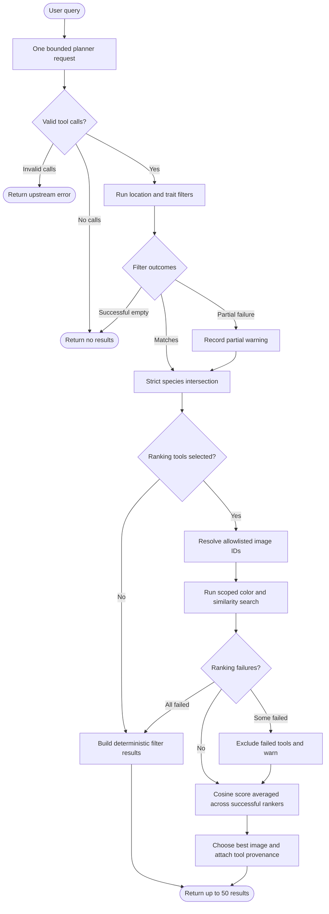

```mermaid
flowchart TD
    Start([User query]) --> Planner[One bounded planner request]
    Planner --> Validate{Valid tool calls?}
    Validate -- No calls --> Empty([Return no results])
    Validate -- Invalid calls --> Error([Return upstream error])
    Validate -- Yes --> Filters[Run location and trait filters]
    Filters --> Outcomes{Filter outcomes}
    Outcomes -- Successful empty --> Empty
    Outcomes -- Matches --> Intersect[Strict species intersection]
    Outcomes -- Partial failure --> Warn[Record partial warning]
    Warn --> Intersect
    Intersect --> Rank{Ranking tools selected?}
    Rank -- No --> FilterResults[Build deterministic filter results]
    Rank -- Yes --> Scope[Resolve allowlisted image IDs]
    Scope --> Vectors[Run scoped color and similarity search]
    Vectors --> Partial{Ranking failures?}
    Partial -- Some failed --> RankWarn[Exclude failed tools and warn]
    Partial -- All failed --> FilterResults
    Partial -- No --> Score[Cosine score averaged across successful rankers]
    RankWarn --> Score
    Score --> Aggregate[Choose best image and attach tool provenance]
    FilterResults --> Return([Return up to 50 results])
    Aggregate --> Return
```
